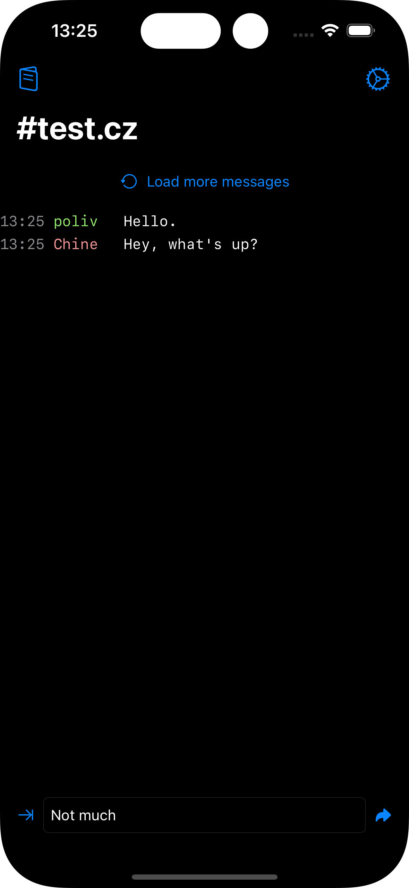
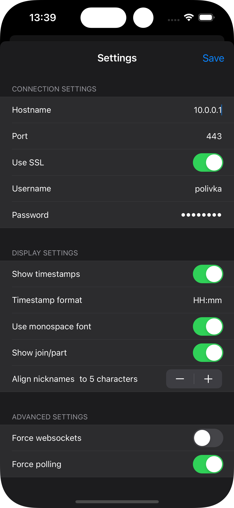

# iLounge
**iLounge is a WIP a native iOS application that lets you connect to your [The Lounge](https://github.com/thelounge/thelounge) instance (self-hosted web IRC client).**

* This is basically my Swift/SwiftUI learning project, so don't expect much except for bugs and bad code.
* Built using [SocketIO](https://github.com/socketio/socket.io-client-swift) and [Starscream](https://github.com/daltoniam/Starscream).

# WIP
## Currently implemented
* Connecting to The Lounge (creates new session every login as of right now)
* Switching channels
* Setting hostname and port
* Loading messages for channels (including `more` history)
* Sending messages to specific channels
* Aligning nicknames to specific number of characters
* Set hostname, port, SSL, username, password
* Custom timestamp format (or toggle timestamps)
* Toggle between monospace/sans serif font for messages
* Clickable links, with in-app previews for URLs that look like images (simple regex JPEG/PNG/etc.)
* Nickname colors matching the ones in default The Lounge CSS (when Light appearance is set in iOS) and the Morning CSS (Dark appearance)  

## Limitations/not yet implemented/broken
* Currently targetting iOS 17 and up (hoping to get this down to iOS 15) ([#3](issues/3)
* Scrolling is broken and needs some fixing ([#2](issues/2)
* Sending messages with Enter works, but scrolls the ScrollView arbitrarily ([#2](issues/2)
* Image/video uploading services
* Need to escape Markdown coming in from messages ([#1](issues/1)
* Need to make the Message/Channel/etc. models better and introduce models for other stuff
* Currently user needs to force websockets or polling to successfully connect
* Need to fix the networking in general
* _And many more things to be done..._

## Current state screenshots
 
